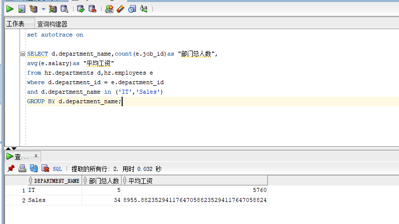
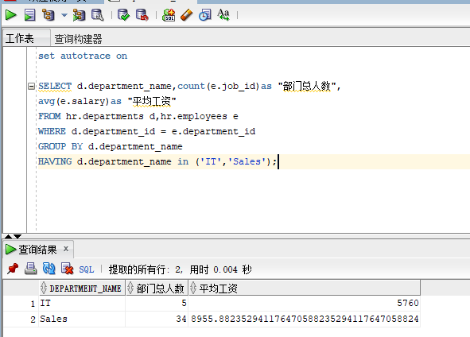
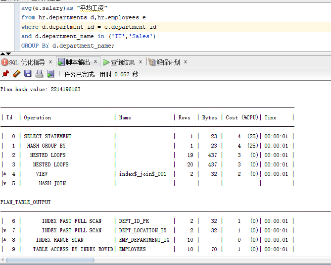
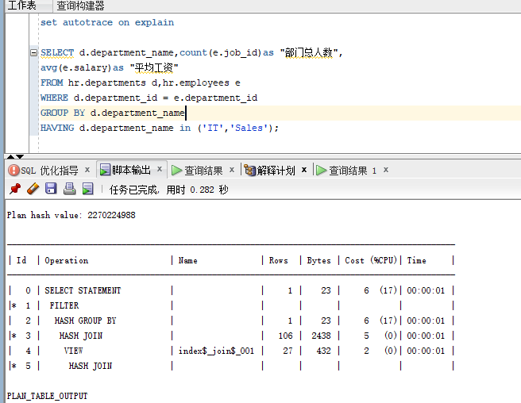
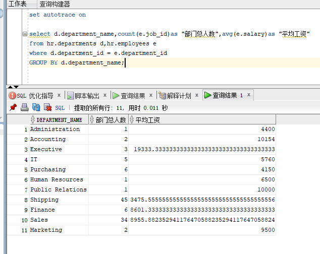
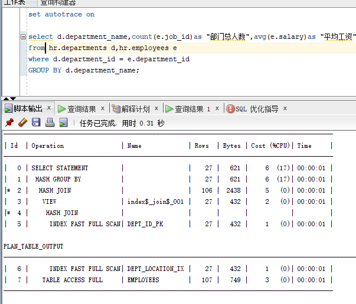

# 实验1：SQL语句的执行计划分析与优化指导

## 18软件工程3班 李林荫 201810414312
## 实验目的

  分析SQL执行计划，执行SQL语句的优化指导。理解分析SQL语句的执行计划的重要作用。

## 实验内容

- 对Oracle12c中的HR人力资源管理系统中的表进行查询与分析。
- 首先运行和分析教材中的样例：本训练任务目的是查询两个部门('IT'和'Sales')的部门总人数和平均工资，以下两个查询的结果是一样的。但效率不相同。
- 设计自己的查询语句，并作相应的分析，查询语句不能太简单。

## 教材中的查询语句
- 查询1:
```
set autotrace on

SELECT d.department_name,count(e.job_id)as "部门总人数",
avg(e.salary)as "平均工资"
from hr.departments d,hr.employees e
where d.department_id = e.department_id
and d.department_name in ('IT','Sales')
GROUP BY d.department_name;
```


- 查询2:
```
set autotrace on

SELECT d.department_name,count(e.job_id)as "部门总人数",
avg(e.salary)as "平均工资"
FROM hr.departments d,hr.employees e
WHERE d.department_id = e.department_id
GROUP BY d.department_name
HAVING d.department_name in ('IT','Sales');
```




## SQL语句分析
### 查看查询1代码执行计划
```
set autotrace on explain

SELECT d.department_name,count(e.job_id)as "部门总人数",
avg(e.salary)as "平均工资"
from hr.departments d,hr.employees e
where d.department_id = e.department_id
and d.department_name in ('IT','Sales')
GROUP BY d.department_name;
```

### 查看查询2代码执行计划
```
set autotrace on explain

SELECT d.department_name,count(e.job_id)as "部门总人数",
avg(e.salary)as "平均工资"
FROM hr.departments d,hr.employees e
WHERE d.department_id = e.department_id
GROUP BY d.department_name
HAVING d.department_name in ('IT','Sales');
```


      通过执行计划比较，可以看到查询1占用cpu最高25%,但是查询所用的rows最高为20行，而查询2占用cpu最高17%，查询所用的rows最高为106行。即查询1查询了更少的表，效率更高，但是查询时所用cpu也更高。


### 设计自己的查询语句
- 查询各个部分的总人数以及平均工资

```
set autotrace on

select d.department_name,count(e.job_id)as "部门总人数",avg(e.salary)as "平均工资"
from hr.departments d,hr.employees e
where d.department_id = e.department_id
GROUP BY d.department_name;
```



- 优化分析



    通过执行计划能够看出此查询在运行时占用的cpu为17%，而查询的rows最多为106行，应该可以通过查询语句做rows删减，这是本代码不足的地方。

