# 实验6：基于Oracle的成绩管理系统数据库设计

## 18软件工程3班 李林荫 201810414312
## 期末考核要求

- 自行设计一个信息系统的数据库项目，自拟某项目名称。
- 设计项目涉及的表及表空间使用方案。至少5张表和5万条数据，两个表空间。
- 设计权限及用户分配方案。至少两类角色，两个用户。
- 在数据库中建立一个程序包，在包中用PL/SQL语言设计一些存储过程和函数，实现比较复杂的业务逻辑，用模拟数据进行执行计划分析。
- 设计自动备份方案或则手工备份方案。
- 设计容灾方案。使用两台主机，通过DataGuard实现数据库整体的异地备份(可选)。

### 表的创建以及数据导入
创建表空间
- 永久表空间的创建
```
SQL> create tablespace studentspace
  2  datafile 'D:\作业\oracle作业\shiyan\studentspace.dbf'
  3  size 50m
  4  autoextend on
  5  next 5m
  6  maxsize 100m;
```
- 临时表空间的创建
```
SQL> create temporary tablespace studenttemp
  2  tempfile 'D:\作业\oracle作业\shiyan\studenttemp.dbf'
  3  size 10m
  4  autoextend on
  5  next 2m
  6  maxsize 20m;

```
- 撤销表空间的创建
```
SQL> create undo tablespace studentundo
  2  datafile 'D:\作业\oracle作业\shiyan\studentundo.dbf'
  3  size 50m
  4  autoextend on
  5  next 5m
  6  maxsize 100m;

```

修改表空间
- 通过数据字典dba_data_file查看studentspace表空间的数据文件信息
```

SQL> select tablespace_name,file_name,bytes
  2  from dba_data_files
  3  where tablespace_name='STUDENTSPACE';

```
- 修改studentspace表空间对应的数据文件的大小
```
SQL> alter database
  2  datafile 'D:\作业\oracle作业\shiyan\STUDENTSPACE.DBF'
  3  resize 40m;


```
- 为studentspace表空间添加一个新的数据文件

```
SQL> alter tablespace studentspace
  2  add datafile
  3  'D:\作业\oracle作业\shiyan\STUDENTSPACE1.DBF'
  4  size 10m
  5  autoextend on next 5m maxsize 40m;
```

表的创建
- 创建用户类别表
```
SQL> create table user_type(
  2  typeid number(10) primary key,
  3  typename varchar2(10) not null
  4  )tablespace studentspace;

```
- 创建用户信息表
```
SQL> create table users(
  2  userid varchar2(10) primary key,
  3  uname varchar2(10) not null,
  4  pwd varchar2(20) not null,
  5  typeid number(10) not null,
  6  constraint users_type foreign key (typeid)
  7  references type(typeid)
  8  )tablespace studentspace;
```
- 创建专业信息表

```
SQL> create table major(
2  majorid number(10) primary key,
3  majorname varchar(20) not null)
4  tablespace studentspace;
```
- 创建班级信息表

```
SQL> create table class(
2  classid number(10) primary key,
3  classname varchar2(10) not null,
  4  majorid number(10) not null,
  5  constraint class_major foreign key(majorid)
  6  references major(majorid)
  7  ) tablespace studentspace;

```
- 创建学生信息表
```
SQL> create table student(
  2  sno number(10) primary key,
  3  sname varchar2(4) not null,	
  4  sex char(2) not null
  5  check (sex in('男','女')),
  6  classid number(10) not null,
  7  majorid number(10) not null,
  8  constraint student_class foreign key(classid)
  9  references class(classid),
 10  constraint student_major foreign key(majorid)
 11  references major(majorid)
 12  )tablespace studentspace;

```
- 创建教师信息表
```
SQL> create table teacher(
  2  tno number(10) primary key,
  3  tname varchar2(4) not null,
  4  sex char(2) not null
  5  check (sex in('男','女')),
  6  majorid number(10) not null,
  7  constraint teacher_major foreign key(majorid)references major(majorid)
8  )tablespace studentspace;

```
- 创建课程信息表
```
SQL> create table course(
  2  cno number(10) primary key,
  3  cname varchar(20) unique not null,
  4  credit number(2) not null)tablespace studentspace;

```
- 创建学生成绩表
```
SQL> create table grade(
  2  sno number(10) primary key,
  3  sname varchar2(10) not null,
  4  cno number(10) not null,
  5  cname varchar2(20) not null,
  6  grade number(3) not null,
  7  credit number(3) not null,
  8  constraint grade_student foreign key(sno)references student(sno),
 9  constraint grade_course foreign key(cno)references course(cno)
 10  )tablespace studentspace;

```

对表插入数据。
```
-- student表数据插入20000
declare 
i int;
sno number(20);
sname VARCHAR2(100);
sex VARCHAR2(100);
classid number(20);
majorid number(20);
begin
i:=1;
while i<=20000 
loop
sno:=i;
sname:= ''|| i;
sex := '男'|| i;
classid := '123'|| i;
majorid := '123'|| i;
insert into train_( sno,sname,sex,classid,majorid) values (sno,sname,sex,classid,majorid);
i:=i+1;
end loop;
commit;
end;
/

-- grade表数据插入20000

declare 
i int;
sno number(20);
sname VARCHAR2(100);
cno VARCHAR2(100);
cname number(20);
grade number(20);
credit number(3)
begin
i:=1;
while i<=20000 
loop
sno:=i;
sname:= ''|| i;
sex := '男'|| i;
classid := '123'|| i;
majorid := '123'|| i;
insert into train_( sno,sname,cno,cname,grade,credit) values( sno,sname,cno,cname,grade,credit);
i:=i+1;
end loop;
commit;
end;
/

```
- 总共有10张基本表，创建了10个存储过程对每个基本表插入数据。
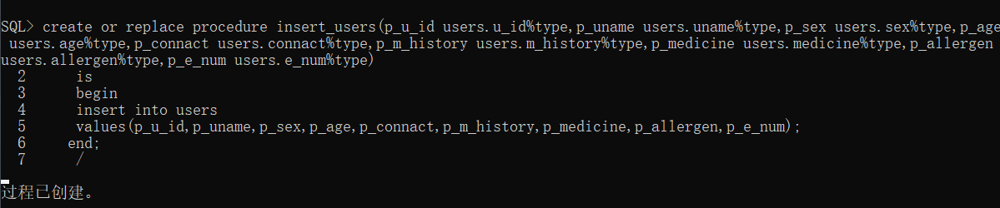
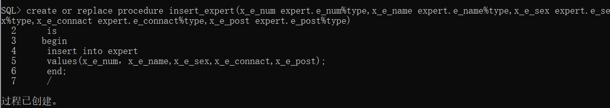
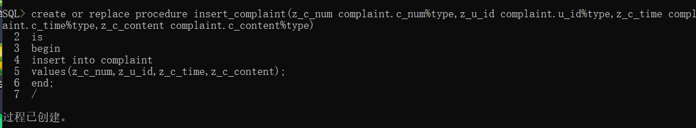
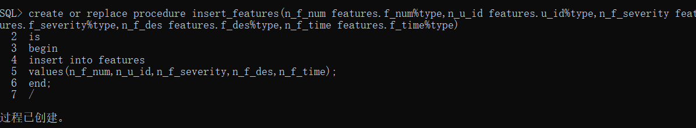
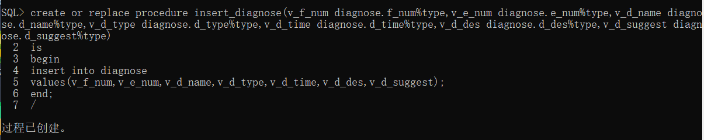
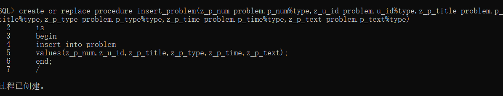
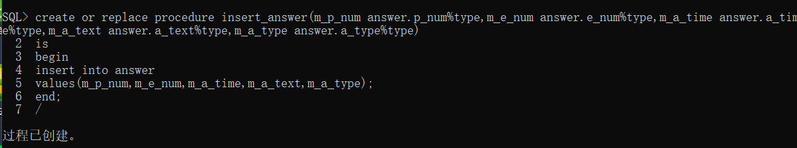
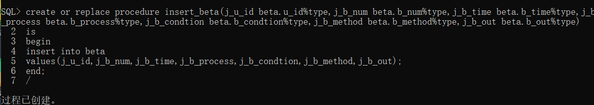
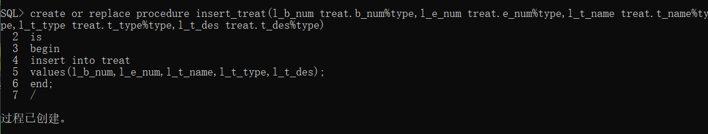
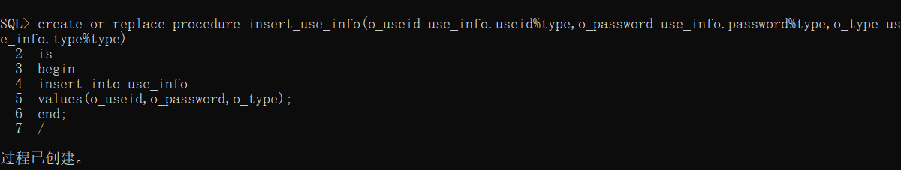


建立存储过程和函数
- 创建查询姓李的姓名的存储过程
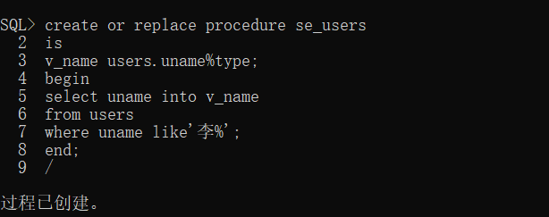

- 创建了通过编号搜索个人信息的自定义函数
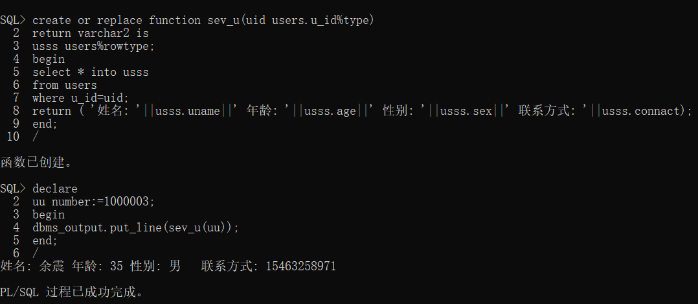


备份方案 ：RMAN（备份与恢复管理器）
- 1.为目录创建一个单独的表空间
SQL>Create tablespace tools datafile ‘fielname’ size 50m;
- 2.创建RMAN用户
SQL>Create user RMAN identified by RMAN default tablespace tools temporary tablespace temp;
- 3.给RMAN授予权限
SQL>Grant connect , resource , recovery_catalog_owner to rman;
- 4.打开RMAN
$>RMAN
- 5.连接数据库
RMAN>connect catalog rman/rman
- 6.创建恢复目录
RMAN>Create catalog tablespace tools
注册目标数据库，恢复目录创建成功后，就可以注册目标数据库了，目标数据库就是需要备份的数据库，一个恢复目录可以注册多个目标数据库，注册目标数据库的命令为：
$>RMAN target internal/password catalog rman/rman@rcdb;
RMAN>Register database;
数据库注册完成,就可以用RMAN来进行备份了，更多命令请参考ORACLE联机手册或《ORACLE8i备份与恢复手册》。
注销数据库不是简单的在RMAN提示下反注册就可以了，需要运行一个程序包，过程如下：
- 1. 连接目标数据库，获得目标数据库ID
$> RMAN target internal/password catalog rman/rman@rcdb;
 RMAN-06005: connected to target database: RMAN (DBID=1231209694)
- 2. 查询恢复目录，得到更详细的信息
SQL> SELECT db_key, db_id FROM db WHERE db_id = 1231209694;
 
DB_KEY     DB_ID     
---------- ---------------
      1 1237603294
1 row selected.
- 3.运行过程dbms_rcvcat.unregisterdatabase注销数据库，如
SQL> EXECUTE dbms_rcvcat.unregisterdatabase(1 , 1237603294)
- 4采用RMAN进行备份

+ 1.备份整个数据库
 backup full tag ‘basicdb’ format ‘/bak/oradata/full_%u_%s_%p’ database;
+ 2.备份一个表空间
 backup tag ‘tsuser’ format ‘/bak/oradata/tsuser_%u_%s_%p’ tablespace users;
+ 3.备份归档日志
 backup tag ‘alog’ format ‘/bak/archivebak/arcbak_%u_%s_%p’ archivelog all delete input;